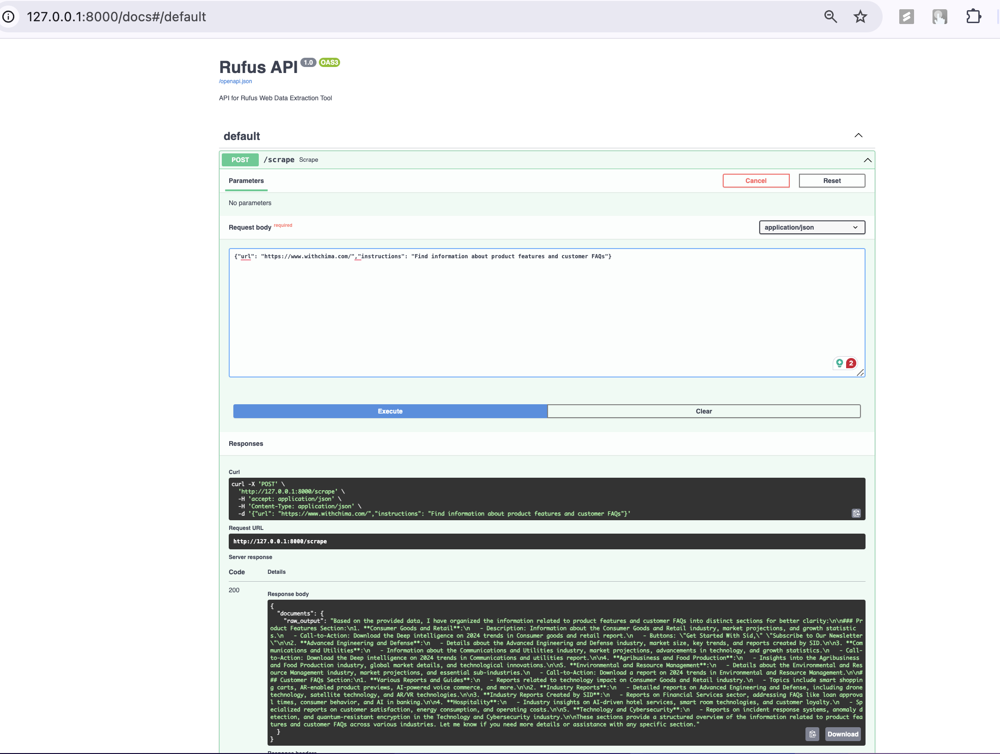

# chima-rufus-scrapper

# Rufus

**Rufus** is an intelligent web data extraction tool designed to prepare web data for Retrieval-Augmented Generation (RAG) agents. It intelligently crawls websites based on user-defined prompts, extracts relevant data, and synthesizes it into structured documents suitable for RAG systems.

## Features

- **Intelligent Crawling:** Navigates websites based on specific instructions.
- **Selective Scraping:** Extracts only relevant data as per user prompts.
- **Document Synthesis:** Converts extracted data into structured formats (e.g., JSON).
- **API Integration:** Provides an intuitive API for seamless integration.
- **Error Handling:** Robust mechanisms to handle inaccessible pages or structural changes.

## Technology Stack

- **Programming Language:** Python 3.8+
- **Web Scraping Libraries:** Requests, BeautifulSoup, Selenium
- **Natural Language Processing:** OpenAI GPT
- **API Framework:** FastAPI
- **Data Storage:** JSON
- **Version Control:** GitHub
- **Testing:** PyTest
- **Environment Management:** virtualenv

## Setup Instructions

1. **Clone the Repository:**

    ```bash
    git clone https://github.com/yourusername/Rufus.git
    cd Rufus
    ```

2. **Set Up Virtual Environment:**

    ```bash
    python3 -m venv venv
    source venv/bin/activate  # On Windows: venv\Scripts\activate
    ```

3. **Install Dependencies:**

    ```bash
    pip install -r requirements.txt
    ```

4. **Configure Environment Variables:**

    - Create a `.env` file in the root directory.
    - Add your OpenAI API key:

      ```plaintext
      OPENAI_API_KEY=your_openai_api_key_here
      ```

5. **Run the API Server:**

    ```bash
    uvicorn api.main:app --reload
    ```

6. **Access API Documentation:**

    Navigate to `http://127.0.0.1:8000/docs` in your browser to view and interact with the API documentation.

## Usage Example

### Using RufusClient Directly

```python
# example.py
from RufusClient.client import RufusClient
import json

def main():
    instructions = "Find information about HR policies and FAQs."
    client = RufusClient(user_prompt=instructions)
    documents = client.scrape("https://www.sfgov.com")
    print(json.dumps(documents, indent=4))

if __name__ == "__main__":
    main()
```


## Using the API
### Send a POST request to the /scrape endpoint with the URL and instructions.




Navigate to http://127.0.0.1:8000/docs# to access the interactive Swagger UI documentation.


```bash
curl -X POST "http://127.0.0.1:8000/scrape" -H "Content-Type: application/json" -d {"url": "https://www.withchima.com/","instructions": "Find information about product features and customer FAQs"}'
```


## Testing
### Run tests using PyTest:

```bash
pytest
```

## License
### MIT License

## Acknowledgements
### Built with ❤️ by Gokul